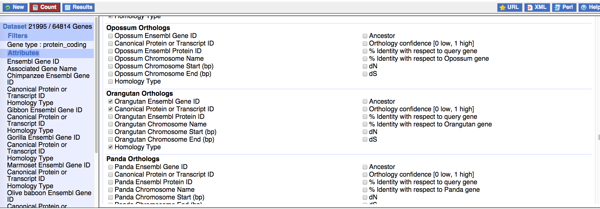
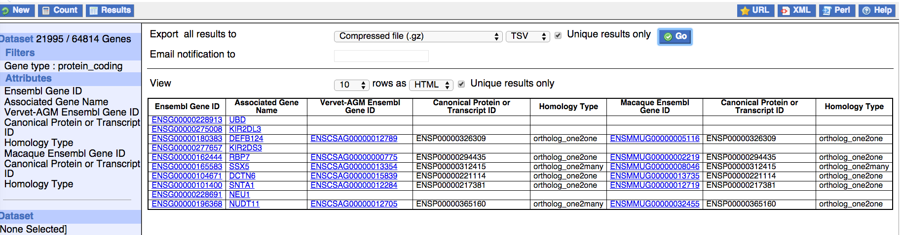

# Genome-scale detection of positive selection in 9 primates

This page contains scripts, analyses and procedures developed in:

> **Genome-scale detection of positive selection in 9 primates predicts human-virus evolutionary conflicts**
> Robin van der Lee, Laurens Wiel, Teunis J.P. van Dam, Martijn A. Huynen  
> bioRxiv 131680; https://doi.org/10.1101/131680

> Centre for Molecular and Biomolecular Informatics - Radboud Institute for Molecular Life Sciences<br/>
> Radboud university medical center<br/>
> Nijmegen, The Netherlands

Please consider citing the paper if you found this resource useful.


## Issues & Contact

Note that these scripts were not designed to function as a fully-automated pipeline, but rather as a series of steps with extensive manual quality control between them. It will therefore not be straightforward to run all steps smoothly in one go. Feel free to contact me if you run into any issue with individual steps.

> **robinvanderlee AT gmail DOT com**<br/><br/>
> [Google Scholar](https://scholar.google.co.uk/citations?user=ISYCcUUAAAAJ)<br/>
> [ORCID](http://orcid.org/0000-0001-7391-9438)<br/>
> [Twitter](https://twitter.com/robinvdlee)<br/>
> [LinkedIn](http://nl.linkedin.com/in/robinvdlee)


## Supplementary data and material

Additional data and material can be found at:
- This GitHub page: [Supplementary data and material](Supplementary_data_and_material)<br/>

and
- http://www.cmbi.umcn.nl/~rvdlee/positive_selection/


## Requirements

Scripts depend on various programs and modules to run. Refer to the paper for which versions were used.
*Make sure all of these programs are in your [`$PATH`](http://www.linfo.org/path_env_var.html)*<br/>

#### Perl
- Perl 5: https://www.perl.org/
- Install various modules using `cpan` or `cpanm`
	- `cpanm DBI`
	- `cpanm DBD::mysql`  (requires a working mysql installation, https://www.mysql.com/)
- Download the various helper scripts that are also part of this GitHub repository
	- `functions.pl`
	- Scripts in `Ensembl_API_subroutines`

#### BioPerl & Ensembl API
- BioPerl `cpanm Bio::Perl` (http://bioperl.org/)
- Ensembl API (http://www.ensembl.org/info/docs/api/index.html)

#### R
- R: https://www.r-project.org/

*****************
- Install the following packages:
	- ``
R
	+ modules
	?? gebruik ik dit script? ./Biological_correlations_PSR/basic_statistics_of_data/aa_freqs/analyze_aa_freqs.r:require(lattice)
library("Biostrings")
library("biomaRt")
library("ggplot2")
library("phangorn")
library("session")
library(GenomicRanges)
library(MASS)
library(data.table)
library(dplyr)
library(ggplot2)
library(gplots)
library(gridExtra)
library(jsonlite)
library(parallel)
library(plotrix)
library(rtracklayer)
library(scales)
library(vioplot)
*****************


#### Command line tools
GNU Parallel (https://www.gnu.org/software/parallel/)

#### Aligners and alignment analysis tools
- PRANK multiple sequence aligner (http://wasabiapp.org/software/prank/)
- GUIDANCE (http://guidance.tau.ac.il/)<br/>
*Note that a bug fix is required for GUIDANCE (version 1.5 - 2014, August 7) to work with PRANK, see [GUIDANCE_source_code_fix_for_running_PRANK](Supplementary_data_and_material/GUIDANCE_source_code_fix_for_running_PRANK/)*
- t_coffee, which includes `TCS` (http://www.tcoffee.org/Projects/tcoffee/)
- Jalview alignment viewer (http://www.jalview.org/)

#### PAML
PAML software package, which includes `codeml` (http://abacus.gene.ucl.ac.uk/software/paml.html)


## Steps

Please see the `Materials and Methods` section of the paper for theory and detailed explanations.<br/>
Analyses presented in the paper are based on Ensembl release 78, December 2014 (http://dec2014.archive.ensembl.org/).

### 1. One-to-one orthologs
Obtain one-to-one ortholog clusters for nine primates with high-coverage whole-genome sequences. These scripts can be edited to obtain orthology clusters for (i) a different set of species than the ones we use here, and (ii) different homology relationships than the one-to-one filter we use.<br/>
Two methods, same result:

#### 1a. Ensembl API method
1. Fetch orthology information using the Ensembl API: `get_one2one_orthologs__Ensembl_API.pl`
2. Clean the results using: `get_one2one_orthologs__Ensembl_API__process_orthologs.r`

#### 1b. Ensembl BioMart method 
1. From BioMart, first get orthology information for all species of interest


2. Combine the acquired ortholog information using `get_one2one_orthologs__combine_biomart_orthology_lists.r`


### 2. Sequences
For all one-to-one orthologs, get the coding DNA (cds) and the corresponding protein sequences from the Ensembl Compara gene trees (as these trees are the basis for the orthology calls).

#### 2a. Get sequences
1. Run `start_parallel_sequence_fetching.pl`, which reads the ortholog cluster information, divides the genes in batches of 1000 (`$batchsize` can be changed in the script) and prints the instructions for the next step:
2. `get_sequences_for_one2one_orthologs_from_gene_tree_pipeline.pl`. This step fetches the sequences. E.g.
```bash
STARTING PARALLEL INSTANCE 11
from 10001 to 11000
1000 genes
screen -S i11
perl get_sequences_for_one2one_orthologs_from_gene_tree_pipeline.pl -p -f sequences/parallel_instance_11.txt
```
Note that these steps also fetch the alignments underlying the Compara gene trees, filtered for the species of interest. These are not required for later steps.

#### 2b. Check sequences
`check_compatibility_protein_cds_sequences.pl`. Tends to only complain at annotated selenocysteine residues.


### 3. Alignments
Produce codon-based nucleotide sequence alignments for all the one-to-one ortholog clusters. Then assess the confidence in the alignments using two indepedent approaches.

#### 3a. PRANK codon-based multiple alignment
This step collects all fasta files containing cDNA sequences for the species of interest, and for each of them runs the `PRANK` in codon mode (`-codon`) to align them. Jobs are executed and monitored in parallel using `GNU Parallel` (set number of cores with `--max-procs`).
```bash
find sequences/ -type f -name "*__cds.fa" | parallel --max-procs 4 --joblog parallel_prank-codon.log --eta 'prank +F -codon -d={} -o={.}.prank-codon.aln.fa -quiet > /dev/null'
```
This effectively execute the following commands:
```bash
find sequences/ -type f -name "*__cds.fa" | parallel 'echo prank +F -codon -d={} -o={.}.prank-codon.aln.fa -quiet'
```
```bash
...
prank +F -codon -d=sequences//cds/ENSG00000274211__cds.fa -o=sequences//cds/ENSG00000274211__cds.prank-codon.aln.fa -quiet
prank +F -codon -d=sequences//cds/ENSG00000274523__cds.fa -o=sequences//cds/ENSG00000274523__cds.prank-codon.aln.fa -quiet
prank +F -codon -d=sequences//cds/ENSG00000019549__cds.fa -o=sequences//cds/ENSG00000019549__cds.prank-codon.aln.fa -quiet
...
```

#### 3b. GUIDANCE - assessment and masking
**NOTE:** *this step takes a lot of computation time.*<br/>

1. Run GUIDANCE to assess the sensitivity of the alignment to perturbations of the guide tree.<br/>
*Note that this requires a bug fix in GUIDANCE (version 1.5 - 2014, August 7), see [GUIDANCE_source_code_fix_for_running_PRANK](Supplementary_data_and_material/GUIDANCE_source_code_fix_for_running_PRANK/)*
```bash
find sequences/ -type f -name "*__cds.fa" | parallel --max-procs 4 --nice 10 --joblog parallel_guidance-prank-codon.log --eta 'mkdir -p sequences/guidance-prank-codon/{/.}; guidance.pl --program GUIDANCE --seqFile {} --seqType nuc --msaProgram PRANK --MSA_Param "\+F \-codon" --outDir sequences/guidance-prank-codon/{/.} &> sequences/guidance-prank-codon/{/.}/parallel_guidance-prank-codon.output'
```

2. `mask_msa_based_on_guidance_results.pl`. Analyze and parse the GUIDANCE results. Low confidence scores led us to remove entire alignments from our analysis or mask unreliable individual columns and codons.

#### 3c. TCS - assessment and masking
Run T-Coffee TCS to assess alignment stability by independently re-aligning all possible pairs of sequences. Note that we ran TCS on translated PRANK codon alignments.<br/>

1. Translate the PRANK alignments to protein. Note that we use the PRANK alignments generated through GUIDANCE (Step 3b) to ensure we are masking the same alignments with both GUIDANCE and TCS!
```bash
mkdir -p sequences/tcs-prank-codon
find sequences/prank-codon-masked/ -type f -name "*__cds.prank-codon.aln.fa" | parallel --max-procs 4 --nice 10 --joblog parallel_translate-prank-codon-alignments.log --eta 't_coffee -other_pg seq_reformat -in {} -action +translate -output fasta_aln > sequences/tcs-prank-codon/{/.}.translated.fa'
```

2. Run TCS on the translated PRANK alignments:
```bash
cd sequences/tcs-prank-codon
find . -type f -name "*prank-codon.aln.translated.fa" | parallel --max-procs 4 --nice 10 --joblog ../../parallel_tcs-t-coffee.log --eta 't_coffee -infile {} -evaluate -method proba_pair -output score_ascii, score_html -quiet  > /dev/null'
cd ../../
```

3. `mask_msa_based_on_tcs_results.pl`. Analyze and parse the TCS results. Low confidence scores led us to remove entire alignments from our analysis or mask unreliable individual columns and codons. Note that we mask the original PRANK codon-based alignments based on the TCS results on the translated alignment!

#### 3d. Sort and translate alignments
1. Sort sequences within alignment fasta files by species using `sort_sequences_by_taxon.pl`, so that all alignment files have the same ordering.
```
cd sequences/prank-codon-masked/
find . -type f -name "*prank-codon-guidance-tcs-masked.aln.fa" | parallel --max-procs 4 --joblog ../../parallel_sort_alignments.log --eta --colsep '__cds' 'perl ../../sort_sequences_by_taxon.pl {1}__cds{2} {1}__cds.prank-codon-guidance-tcs-masked-species-sorted.aln.fa'
cd ../../
```

2. Translate masked cDNA alignments to facilitate quality control and visualization:
```
find sequences/prank-codon-masked/ -type f -name "*__cds.prank-codon-guidance-tcs-masked-species-sorted.aln.fa" | parallel --max-procs 4 --nice 10 --joblog parallel_translate-prank-codon-guidance-tcs-masked-species-sorted-alignments.log --eta 't_coffee -other_pg seq_reformat -in {} -action +translate -output fasta_aln > sequences/prank-codon-masked/{/.}.translated.fa'
```


### 4. Evolutionary analyses
Perform maximum likelihood (ML) dN/dS analysis to infer positive selection of genes and codons, using `codeml` in the PAML software package.

#### 4a. Reference phylogenetic tree
Construct a single phylogenetic tree with branch lengths for use in the ML analysis of all one-to-one otrholog cluster alignments.<br/>

1. `perl concatenate_alignments.pl`. Concatenate all 11,096 masked alignments from Step 3 (i.e. the GUIDANCE- and TCS-masked codon-based alignments) into one large alignment. First make sure individual alignment files are sorted in the same way (see Step 3d).
	
2. Sort sequences within the concatenated alignment again by species:
```
perl sort_sequences_by_taxon.pl sequences/concatenated_alignment__9primates__cds.prank-codon-guidance-tcs-masked.aln.fa sequences/concatenated_alignment__9primates__cds.prank-codon-guidance-tcs-masked-species-sorted.aln.fa
```

3. Convert concatenated alignment from FASTA to a PHYLIP format that is compatible with PAML codeml. Script checks that (i) sequence names do not contain characters that cannot be handled by codeml, (ii) sequences do not contain stop codons or non-canonical nucleotides, (iii) undetermined and masked codons [nN] are converted to the codeml ambiguity character `?`.
```
perl convert_fasta_to_codeml_phylip.pl sequences/concatenated_alignment__9primates__cds.prank-codon-guidance-tcs-masked-species-sorted.aln.fa
```

4. Run the codeml M0 model on the concatenated alignment. This fits a single dN/dS to all sites (`NSsites = 0, model = 0, method = 1, fix_blength = 0`). We provided codeml with the well-supported topology of the primate phylogeny: [Supplementary data and material](Supplementary_data_and_material/Phylogenetic_Trees/Ensembl78__9primates__with_taxon_id__unrooted.tre). See the `.ctl` files for exact configurations: [Supplementary data and material](Supplementary_data_and_material/Configuration_files_for_PAML_codeml/).<br/>

- Once under the F3X4 codon frequency parameter:
```
mkdir codeml_M0_F3X4
cd codeml_M0_F3X4
cp ../Supplementary_data_and_material/Phylogenetic_Trees/Ensembl78__9primates__with_taxon_id__unrooted.tre .
cp ../Supplementary_data_and_material/Configuration_files_for_PAML_codeml/codeml_M0_F3X4_tree.ctl .

codeml codeml_M0_F3X4_tree.ctl > codeml_M0_F3X4_tree.screen_output
cd ..
```

- Once under the F61 codon frequency parameter:
```
mkdir codeml_M0_F61
cd codeml_M0_F61
cp ../Supplementary_data_and_material/Phylogenetic_Trees/Ensembl78__9primates__with_taxon_id__unrooted.tre .
cp ../Supplementary_data_and_material/Configuration_files_for_PAML_codeml/codeml_M0_F61_tree.ctl .

codeml codeml_M0_F61_tree.ctl > codeml_M0_F61_tree.screen_output
cd ..
```

5. Store the phylogenetic trees outputted by codeml. Ours are [codeml_M0_tree__unrooted_tree__F3X4.tre](Supplementary_data_and_material/Phylogenetic_Trees/codeml_M0_tree__unrooted_tree__F3X4.tre) and [codeml_M0_tree__unrooted_tree__F61.tre](Supplementary_data_and_material/Phylogenetic_Trees/codeml_M0_tree__unrooted_tree__F61.tre).


#### 4b. Inference of positive selection
1. Convert individual alignments from FASTA to a PHYLIP format that is compatible with PAML codeml. Script checks that (i) sequence names do not contain characters that cannot be handled by codeml, (ii) removes gene identifiers from the sequence IDs to make all `.phy` files compatbility with the species names in the phylogenetic tree supplied to codeml, (iii) sequences do not contain stop codons or non-canonical nucleotides, (iv) undetermined and masked codons [nN] are converted to the codeml ambiguity character `?`.
```
find sequences/prank-codon-masked/ -type f -name "*__cds.prank-codon-guidance-tcs-masked-species-sorted.aln.fa" | parallel --max-procs 4 --nice 10 --joblog parallel_covert-to-phylip-prank-codon-guidance-tcs-masked-species-sorted.log --eta 'perl convert_fasta_to_codeml_phylip.pl {}'
```

2. Run codeml. **NOTE:** *this step takes a lot of computation time.*<br/>

These steps prepare the directory structure, copy the template .ctl file and the reference phylogenetic tree to the proper directories, customize the codeml .ctl files for running the analysis on each of the 11,096 alignments, and eventually run the codeml program (from within `start_codeml_for_single_alignment.pl`).<br/>
<br/>
The following code shows how to run the `M7vM8_F61` parameter combination. For the paper, we used four combinations of the following codeml parameters: `NSsites = 1 2` or `NSsites = 7 8`; `CodonFreq = 2` or `CodonFreq = 3`.
```
mkdir codeml_M7vM8_F61
cp start_codeml_for_single_alignment.pl codeml_M7vM8_F61/
cd codeml_M7vM8_F61
cp ../Supplementary_data_and_material/Configuration_files_for_PAML_codeml/codeml_M7vM8_F61__large-scale-analysis__template.ctl .
cp ../Supplementary_data_and_material/Phylogenetic_Trees/codeml_M0_tree__unrooted_tree__F61.tre .

find ../sequences/prank-codon-masked/ -type f -name "*__cds.prank-codon-guidance-tcs-masked-species-sorted.aln.phy" | parallel --max-procs 4 --nice 10 --joblog parallel_codeml__M7vM8_F61.log --eta 'perl start_codeml_for_single_alignment.pl {} codeml_M7vM8_F61__large-scale-analysis__template.ctl'
cd ..
```

To run all four parameter combinations, replace all occurences of:
- `M7vM8_F61`
by:
- M7vM8_F3X4
- M1avM2a_F61
- M1avM2a_F3X4


**********************

In the first of two steps for inferring positive selection using codeml, the 11,096 filtered and masked alignments were subjected to ML analysis under evolutionary models that limit dN/dS to range from 0 to 1 (‘neutral’ model) and under models that allow dN/dS > 1 (‘selection’ model; Text S1)(19). Genes were inferred to have evolved under positive selection if the likelihood ratio test (LRT) indicates that the selection model provides a significantly better fit to the data than does the neutral model (PLRT < 0.05, after Benjamini Hochberg correction for testing 11,096 genes). We included apparent Positively Selected Genes (aPSG) if they met the LRT significance criteria under all four tested ML parameter combinations. 
Second, for the significant aPSG we retrieved from the site-specific codeml ML analyses (step one, above) the Bayesian posterior probabilities, which indicate the individual codons that may have evolved under positive selection (Text S1)(39). We included apparent Positively Selected Residues (aPSR) if their codons were assigned high posteriors under all four ML parameter combinations (Pposterior (ω > 1)   > 0.99). 416 aPSG contain at least one significant aPSR (1405 in total; Figure S2B).

Quality control
We subjected each inferred aPSR and aPSG to visual inspection (Table S3). In this way we identified several indicators for positive selection artefacts that we then used for their automated detection in the complete set. First, we obtained the gene trees for our individual masked alignments using RAxML (38)(-f a -m GTRGAMMAI -N 100). Type-I [orthology] and -II [transcript definitions] artefacts tend to lead to gene trees with (i) a long-branched clade consisting of the set of sequences that are distinct from the others (e.g. paralogs, alternative exons), and (ii) a topology that is not congruent with the well-supported species phylogeny (Figure S3). We filtered out likely false positives by selecting gene trees with an extreme longest/average branch length ratio. Second, to assess the distribution of PSR across exons, we mapped Ensembl exon coordinates for human transcripts to the human protein sequences. Type-II [transcript definitions] and -III [termini] artefacts could often be filtered out by a high concentration of aPSR located to a single exon (Supplementary Files).

GC-biased gene conversion (gBGC)
The effects of gBGC seem specifically correlated to regions of high meiotic recombination in males rather than females (40). We calculated genomic overlaps of PSG and non-PSG with male (8.2% of PSG, 7.7% of non-PSG) and female (6.7% of PSG, 8.1% of non-PSG) recombination hotspots in human, which we obtained from the family-based deCODE maps (41) via the UCSC genome browser (42). Sex-averaged recombination hotspots estimated from linkage disequilibrium patterns were obtained from HapMap Release 22 (43)(43% of PSG, 39% of non-PSG). Human genomic regions under the influence of gBGC were predicted by phastBias (44)(9.1% of PSG, 11.4% of non-PSG).


Some useful commands to monitor progress:
```
XX
```
find sequences/cds/ | grep prank | wc -l
tail -f parallel_guidance-prank-codon.log
find sequences/guidance-prank-codon/ -type f | grep PRANK.std$ | xargs cat | grep Writing -A 1


*****
View alignments and annotations
```bash
Java	-Djava.ext.dirs=/Applications/Jalview/lib/
	-cp /Applications/Jalview/jalview.jar jalview.b.Jalview
	-open <ENSEMBL_ID>__cds.prank-codon-guidance-tcs-masked-species-sorted.aln.translated.fa
```
*****
Jalview annotation files contain annotations for the positively selected residues (PSR), as well as exon coordinates mapped to protein sequences. They can be loaded together with the correct corresponding alignment using (on Mac):
```bash
Java	-Djava.ext.dirs=/Applications/Jalview/lib/
	-cp /Applications/Jalview/jalview.jar jalview.b.Jalview
	-open <ENSEMBL_ID>__cds.prank-codon-guidance-tcs-masked-species-sorted.aln.translated.fa
	-annotations <ENSEMBL_ID>.jalview_aln_feature
	-features <ENSEMBL_ID>.jalview_seq_feature
```


